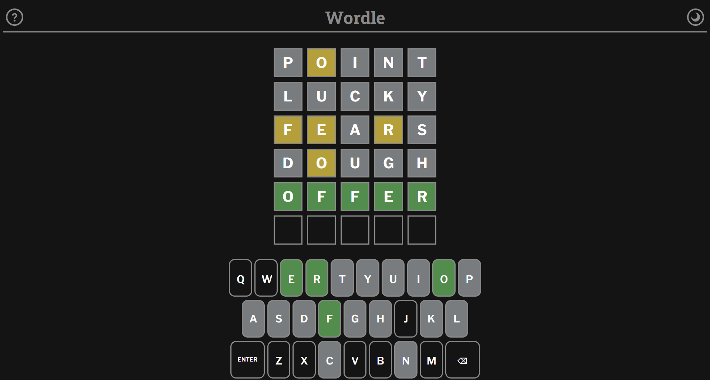

# 🎯 Wordle Game – A Word Guessing Challenge

A simple Wordle-style game built with HTML, CSS, and JavaScript.

## 🎮 How To Play
- A secret 5-letter word is chosen.
- You have **6 tries** to guess it!
- 🟩 **Green**: Letter is correct and in the right place.  
- 🟨 **Yellow**: Letter is in the word but in the wrong place.  
- ⬜️ **Grey**: Letter is not in the word.  
- Guess it in 6 tries to **win** the game!

## 📁 Tech Stack
- HTML  
- CSS  
- JavaScript

## 📦 How to Use
Clone the repo and open `index.html` in your browser:

```bash
git clone https://github.com/saradotdev/Wordle-Game.git
```

## 🔗 Try It Out!
[(https://saradotdev.github.io/Wordle-Game/)](https://saradotdev.github.io/Wordle-Game/)

